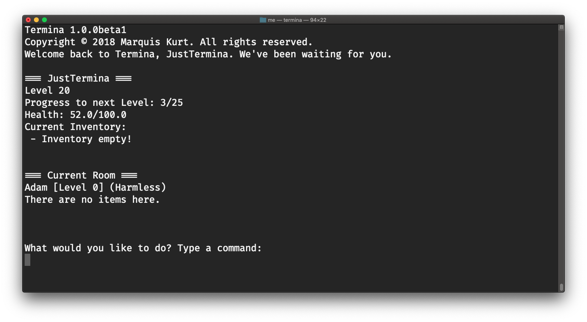
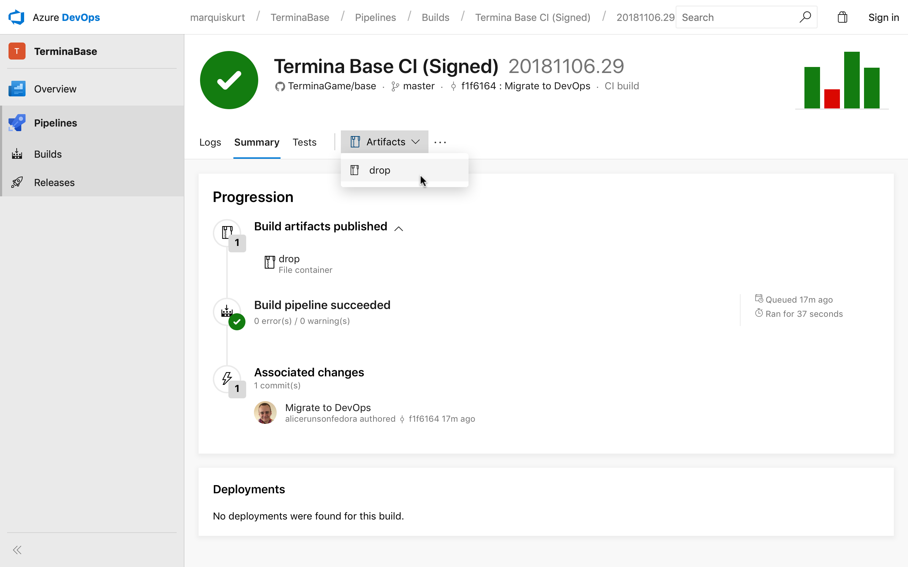

# Termina (Base + CLI)



Termina is a fun single-user, level-based user dungeon game for macOS and Linux.

[)](https://dev.azure.com/marquiskurt/Termina/_build/latest?definitionId=6)


This repository provides the base source code for the game as well as the project files for building the command line version via Xcode.

## Features
- [x] Infinite room generation
- [x] Experience and level system
- [x] Attack and heal system
- [x] Persistent data or load games
- [x] Inventory system
- [x] Command set support

## GUIs
If you're looking for GUI versions, we recommend looking at the following projects:
- [TerminaGame/mac](https://github.com/TerminaGame/mac): official SpriteKit version of Termina for macOS

## Downloads
Currently, there aren't any releases ready for GitHub just yet. Check back another time for one of those!

If you prefer testing builds as they are built off the branch, check out the [Azure DevOps builds](https://dev.azure.com/marquiskurt/Termina/_build/latest?definitionId=6) as they come in.

### Downloading via DevOps

1. Go to the DevOps builds page.
2. Click on the build you'd like to test out.
3. Click 'Artifacts > drop' to download the ZIP file.

### Download via Homebrew
We have packages available through the Homebrew package manager! Just follow the instructions below to get started:

1. Install Homebrew if you haven't already.
2. Run the following commands:

#### Regular
```
brew tap TerminaGame/termina-osx
brew install termina
```

#### Developer Build
```
brew tap TerminaGame/termina-osx
brew install termina-dev
```

## Building from source
Clone the repository via Xcode and run the default scheme to build and test. This requires at least Xcode 9.4.1 and macOS 10.14 Mojave or Swift 4.2.

## About Logging Features
Termina does log information about your current session for your convenience. However, this data is _not_ stored anywhere and will only be saved when the user asks for this log to be exported to a text file (`termlog.txt`).

**Libraries used**:
- [Files](https://github.com/JohnSundell/Files)
- [SwiftyJSON](https://github.com/SwiftyJSON/SwiftyJSON)
- [ColorizeSwift](https://github.com/mtynior/ColorizeSwift/)

**Libraires used in Termina are under their respective licenses.**

## License
Licensed under the Apache License, Version 2.0 (the "License");
you may not use this file except in compliance with the License.
You may obtain a copy of the License at

http://www.apache.org/licenses/LICENSE-2.0

Unless required by applicable law or agreed to in writing, software
distributed under the License is distributed on an "AS IS" BASIS,
WITHOUT WARRANTIES OR CONDITIONS OF ANY KIND, either express or implied.
See the License for the specific language governing permissions and
limitations under the License.
