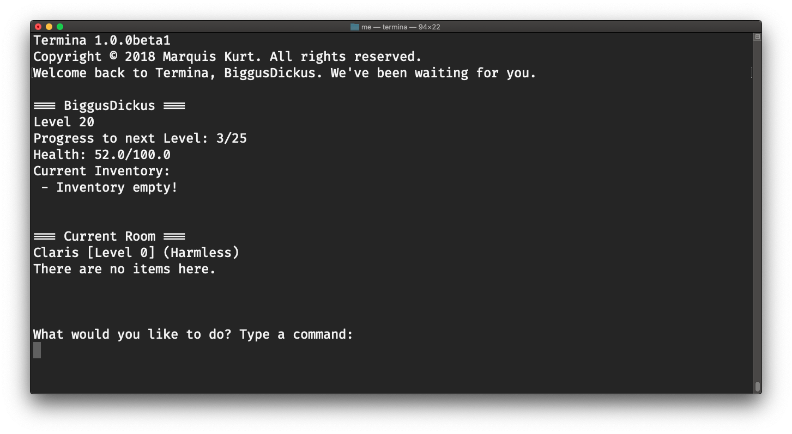

# Termina (Base + CLI)

Termina is a fun single-user, level-based user dungeon game for macOS and Linux.

This repository provides the base source code for the game as well as the project files for building the command line version via Xcode.

## Features
- [x] Infinite room generation
- [x] Experience and level system
- [x] Attack and heal system
- [x] Persistent data or load games
- [x] Inventory system

## GUIs
If you're looking for GUI versions, we recommend looking at the following projects:
- [TerminaGame/mac](https://github.com/TerminaGame/mac): official SpriteKit version of Termina for macOS

## Downloads
Currently, there are no releases of Termina ready for the public. However, feel free to build the source code to try it yourself!

## Building from source
Clone the repository via Xcode and run the default scheme to build and test. This requires at least Xcode 9.4.1 and macOS 10.14 Mojave or Swift 4.2.

## About Logging Features
Termina does log information about your current session for your convenience. However, this data is _not_ stored anywhere and will only be saved when the user asks for this log to be exported to a text file (`termlog.txt`).

**Libraries used**:
- [Files](https://github.com/JohnSundell/Files)
- [SwiftyJSON](https://github.com/SwiftyJSON/SwiftyJSON)
- [ColorizeSwift](https://github.com/mtynior/ColorizeSwift/)

**Termina is licensed under the Apache License. Libraires used in Termina are under their respective licenses.**
